# Mechanisms

The next thing you might want to do is to either add mechanisms to your level or add enemies. With respect to the workflow, both is fine. So you can either jump to the _Enemies_ paragraph or keep reading about mechanisms.

All mechanisms in the game are hard-coded. That means that the only way to change their basic design or behavior by altering the C++ code of the game. Mechanisms use different approaches for their setup. While some might be based on tile layers, others are based on object layers and some use a combination of both.


## Bouncers

Bouncers allow the player to jump very high or bounce him far into the direction the bouncer points to. At the moment only bouncers pointing up are supported.

In order to create a bouncer, create an object group '`bouncers`' and set the object group's `z` property. Then create one rectangle inside the 'bouncers' group for each bouncer.

Now change the object's default properties below:
|Property|Type|Description|
|-|-|-|
|Width|float|The width of the bouncer should be set to `24.0` for horizontally aligned bouncers.|
|Height|float|The height of the bouncer should be set to `5.0` for horizontally aligned bouncers.|

Bouncers use the `tilesets/bumper.png` texture inside your level directory.


## Conveyor Belts

When Adam jumps onto a conveyor belt, he moves along the conveyor belt either to the left or to the right.

Conveyor belts are created just like bouncers. First, create an object group '`conveyorbelts`' and set the object group's `z` property. Now create one rectangle inside the group for each belt.

The belts have a height of half a tile, their width should be a multiple of 24px.

Now change the object's default properties below:
|Property|Type|Description|
|-|-|-|
|Width|float|The width of the belt should be a multiple of `24.0`.|
|Height|float|The height of the belt should be set to `12.0`.|

Next add a custom property for the velocity:

|Custom Property|Type|Description|
|-|-|-|
|velocity|float|Negative values make the player move to the left, positive values move him to the right. Good values are probably something like `-0.6` and `0.6`.|

Conveyor belts use the `tilesets/cbelt.png` texture inside your level directory.


## Doors

Doors are not to be confused with 'Portals'. While the latter teleport you from one place to another, doors serve the purpose of a gate that allows you to move from one room to another.

The door implementation is based on tiles only.

All doors are defined in a layer labelled `doors`. Wherever there are 2 or more adjacent tiles inside this layer, they are merged together to a door. On top of the door there can be an indicator for a required key. There are different keys the player can pick up for different types of doors. At the moment they're all color-coded (red, green, blue, yellow, orange) but the implementation could be changed anytime.

If the door should not require a key to open it, then just don't add a key tile at its top.

Just like every other layer, doors also require a `z` custom property.


## Fans

Fans work just like fans from the real world, however they are _slightly_ stronger than in the real world. So, depending on where they are pointing to, they can make Adam fly or serve as an impassable obstacle.

This mechanism uses a mix of layers and objects. While the fans inside the tile layer called `fans` determine the direction of the air flow, rectangles in the object layer `fans` determine the active area of the fans. The idea is that all fans within one rectangle work together as one unit. So when defining the rectangles make sure they nicely overlap with the fan tiles. You can achieve that by using the `ALT`-key inside Tiled.

Apart from the `z` depth, fans have a 'speed' value:

|Custom Property|Type|Description|
|-|-|-|
|speed|float|The speed value typically ranges from [`0..1`], `0.9` turned out to be a suitable value.|

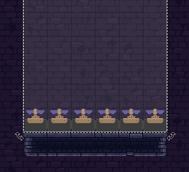


## Lasers

Lasers follow the same concept as fans and are based on a combination of tiles and objects. Since the tileset allows rather complex laser shapes including mirror tiles, the object layer is used so you can group your laser tiles to one coherent 'unit'.

So the first thing you do is to place all your laser tiles inside a tile layer called `lasers_2` and then create an object layer `lasers_2` where you draw a rectangle that covers all the laser tiles that belong together (`_2` because we want to use the 2nd version of the laser implementation).

Apart from the `z` depth, lasers have the custom properties below:

|Custom Property|Type|Description|
|-|-|-|
|off_time|int|The duration the laser is in 'off' state (in ms)|
|on_time|int|The duration the laser is sin 'on' state (in ms)|


### Moving Lasers

To make lasers a little more interesting, there's also the option to make them movable. For that purpose, you can define a polygon inside your lasers layer that defines the movement path.
All you need to do is to give your laser object a name, and then reference that object in your polygon's properties.

|Custom Property|Type|Description|
|-|-|-|
|reference_id|string|The object name of the rectangle that groups your laser tiles|
|movement_speed|float|A velocity factor for the laser movement, the default is `0.2`.|


## Bubble Cubes

Bubble Cubes serve as a solid platform the player can land on and jump off again. However, once the player contact to the Bubble Cube ends, it pops and only respawns after a couple of seconds.

In order to place Bubble Cubes in your level, create an object layer called `bubble_cubes`. In there, just place a rectangle where you'd like to position your Bubble Cube.
Their dimensions (including margin) is 3 x 2 tiles so it makes sense to adjust your rectangle accordingly.

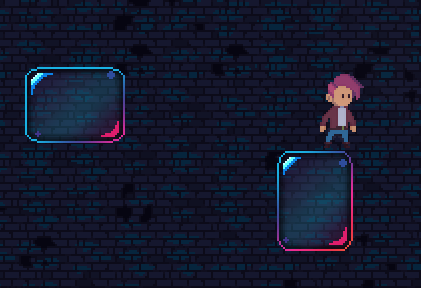

|Custom Property|Type|Description|
|-|-|-|
|animation_offset_s|float|An offset for the bubble animation (in seconds), so they're not in sync. The default value is `0s`.|
|pop_time_respawn_s|float|The time elapsed until the bubble respawns (the default is `3s`).|
|move_down_on_contact|bool|The bubble moves down on foot contact (the default is `true`).|
|move_down_velocity|float|A factor to control the movement velocity when `move_down_on_contact` is enabled (the default is `0.5`).|
|maximum_contact_duration_s|float|If configured, bubbles will pop after the given duration is elapsed (the default is `undefined`).|


## Collapsing Platforms

Collapsing Platforms behave similar to Bubble Cubes. As soon as the player steps onto them, they start shaking for a while, then they collapse.
A little later, they respawn.

In order to place Collapsing Platforms in your level, create an object layer called `collapsing_platforms`.
In there, just place a rectangle where you'd like to position your Collapsing Platform. Make sure that the rectangle height is one tile and its width a multiple of n tiles.


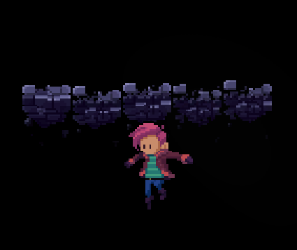

|Custom Property|Type|Description|
|-|-|-|
|time_to_collapse_s|float|The time in seconds it takes for a platform to collapse (the default is 1.0s).|
|destruction_speed|float|A factor for the destruction play speed (the default is 30.0).|
|fall_speed|float|A factor for the fall speed of the blocks (the default is 6.0).|
|time_to_respawn_s|float|The time in seconds it takes for a collapsing platform to respawn (the default is 4.0s).|
|fade_in_duration_s|float|The time in seconds it takes for a respawning platform to fade in (the default is 1.0s).|


## Portals

Portals can teleport Adam from one location to another. For that reason, they give you a lot of freedom in your level design possibilities since you can have a coherent level, even though your individual rooms are distributed all over the map.

When the player enters a portal, a transition animation - like a fade-out/fade-in - is played so the viewer has no idea of what is happening behind the curtains.

In order to create portals, first create a tile layer called `portals` where you place your portal tiles. Then, in an object layer, also called `portals`, you draw a polyline from the center of one portal to another. Now they are linked and the player can go back and forth between them. The first position of the polyline is the entrace, the 2nd position is the exit. Therefore, an exit also be an entrace to another portal. If you only draw a single polyline between two portals, it's just a simple two-way mechanism.

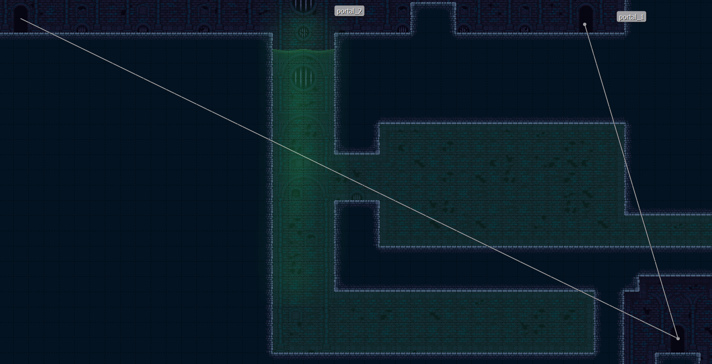

In the screenshot above, Adam enters at the top left, exits at the bottom right, and when he enters again, teleports to the top right.


## Crushers

As the name promises, Crushers can crush Adam. They consist of a bunch of spikes connected to a heavy weight that moves to one direction with high velocity and then retracts again.


Crushers can be added to your level by adding an object layer called `crushers`. To change the Crushers' alignment, please refer to the Custom Properties below:

|Custom Property|Type|Description|
|-|-|-|
|alignment|string|Direction of the Crusher (valid values are '`up`', '`down`', '`left`', '`right`')|


## Death Blocks

Death Blocks are spiky boxes that move back and forth along a given line. Depending on your tilesheet the direction of the Death Block's rails is either horizontal, vertical, but can actually be any arbitrary angle.


Since you draw the 'rails' of the Death Blocks just to a background layer, this mechanism only requires a polyline object added to the object group `death_blocks`


## Levers

Levers! One of the most important mechanisms. In short, they do what levers do: They switch things on and off. Levers can be used to enable and disable the functionality of these mechanisms:
- Conveyor Belts
- Fans
- Lasers
- On/Off Blocks
- Platforms
- Rotating Blades
- Spikes
- Spike Blocks

While you draw your lever objects as 3x2 tile rectangles into an object group called `levers`, a connection between another mechanism and the lever is created by adding an object group `switchable_objects`; in there you draw a rectangle that covers both the object(s) that should be switched on and off as well as the lever.

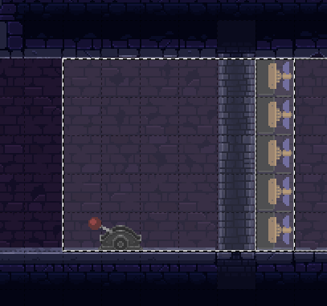

In the screenshot above the fans will go off once the lever is activated.

The properties below apply for the object inside the `levers` object group.

|Custom Property|Type|Description|
|-|-|-|
|enabled|bool|Defines the initial state of the lever which is either enabled or disabled|


## Ropes

The Deceptus Engine is able to connect other objects to ropes attached to mounts. So far this is only used for visual effects, later on - if there is any demand - the Engine can be extended to allow the player to hold on to the rope or attach other objects to it.

Moreover, ropes have a number of properties to simulate 'wind behavior'. So you can also place them next to open windows out outside areas.

So far you can create ropes in your level by creating an object group called `ropes`.

|Custom Property|Type|Description|
|-|-|-|
|push_interval_s|float|The interval how often the rope is pushed (in seconds, a good value is `5.0`)|
|push_duration_s|float|The duration for how long the rope is pushed (in seconds), a good value is `1.0`|
|push_strength|float|The amount of force to be applied for each frame during the push duration (`0.01` is a good value)|
|segments|int|The amount of segments your rope should have (less is better, `7` is a good value)|

Read more about Ropes in the paragraph 'Ropes with Lights'.


## Spike Balls

Spike Balls are nasty. They're heavy balls with spikes connected to a chain which move from left to right and back. Adam can either duck or jump to make his way past them, however it requires a little practice to master them.

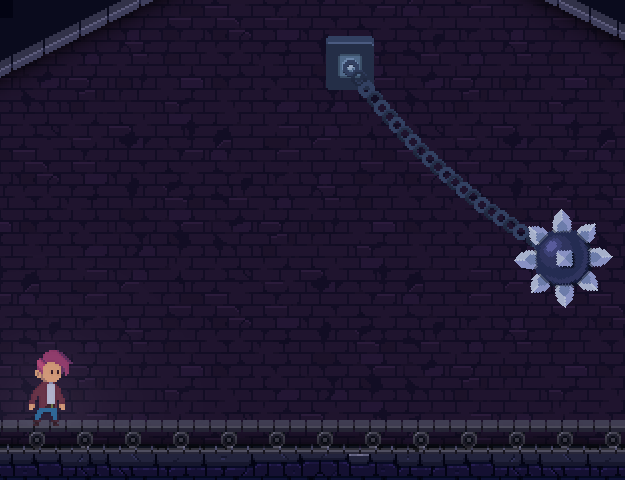

In order to add Spike Balls to your level, you have to create an object layer called `spike_balls`. In there, you place a rectangle at the location where the Spike Ball's chain shall be mounted.

It is very important to place that mount high enough, otherwise the ball will crash into the physics representation of your level and the physics engine will go a bit crazy.

|Custom Property|Type|Description|
|-|-|-|
|z|int|The layer's z index|
|push_factor|float|Each time when the spike ball changes direction, it gets a little push. This is the factor for the force that's applied (default is `0.625`).|
|spline_point_count|int|Chain elements are drawn as a spline so they don't look like a bunch of concatenated edges. This defines the number of elements (default is `25`).|
|chain_element_count|int|The amount of chain elements used for the chain. The default is `10` elements.|
|chain_element_distance_m|float|The distance between chain elements, given in metres. The default is `0.3m`.|
|chain_element_width_m|float|The height of a chain element in metres, the default is `0.06m`.|
|chain_element_height_m|float|The width of a chain element in metres, the default is `0.0125m`.|


## Spikes

Sharp spikes moving out of the ground are making Adam's life even harder. There are three types of spikes:
- Interval Spikes: They extend and retract in 2 second intervals.
- Trap Spikes: They extend upon contact after 250ms.
- Toggle Spikes: Those are enabled or disabled using a lever.

In order to create any of the spike types above, create a tile layer named `toggle_spikes`, `trap_spikes`, or `interval_spikes`. Then draw your spike tiles into any of these layers as needed.

If you do not know how levers work, you can read more about that in the description of the 'Lever' mechanism.

As a side-note. If you want spikes that are extended, just put them into your `toggle_spikes` layer and don't create a connection to any lever.

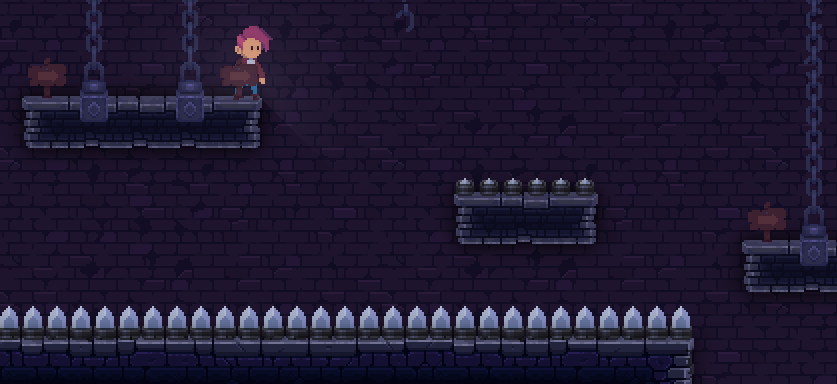


## Spike Blocks

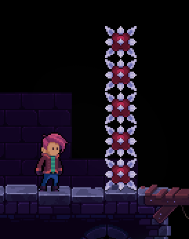

Spike Blocks are small, nasty barriers that  - once extracted - the player cannot easily get past. Usually they are placed in groups, such as rows or columns, but they can be positioned in arbitray shapes. They come in two different modes: Either their state is controlled via the Lever Mechanism, or they extract and retract in given intervals. That's the interval mode.

While they are in lever mode without actually being connected to a lever, they are always extracted.

If you need to know how to connect Spike Blocks to a lever, please check the documentation about the Lever Mechanism.

|Custom Property|Type|Description|
|-|-|-|
|z|int|The layer's z index|
|enabled|bool|The default enabled state (default is `true`)|
|mode|string|The Spike Block's mode, either '`interval`' or '`lever`' (default is '`lever`')|
|time_on_ms|int|When mode is '`interval`', the time the Spike Block is extracted, given in ms (default is 4000ms)|
|time_off_ms|int|When mode is '`interval`', the time the Spike Block is retracted, given in ms (default is 3000ms)|


## On/Off Blocks

On/Off Blocks are basically the friendly version of the Spike Block. When you switch it on, it's just a solid block that could be placed as a barrier, ladder, etc.
When you switch it off, it just disappears and the player does no longer collide with them.

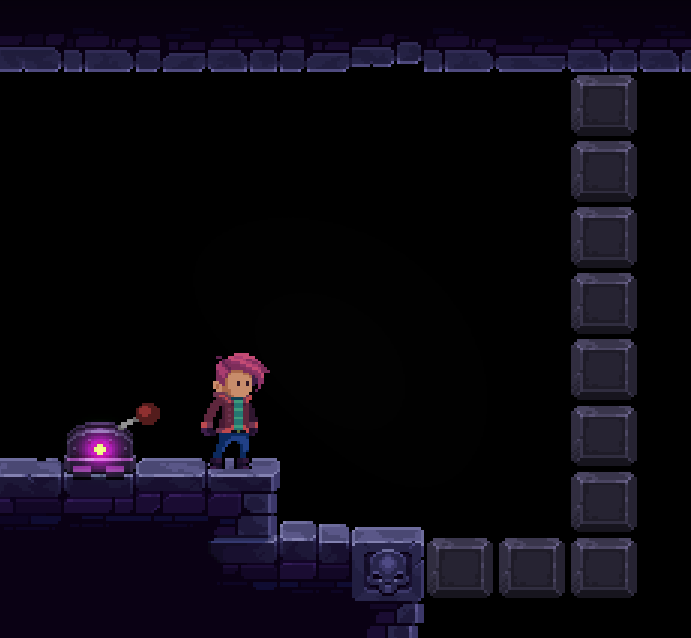

|Custom Property|Type|Description|
|-|-|-|
|z|int|The layer's z index|
|enabled|bool|The default enabled state (default is `true`)|
|mode|string|The Spike Block's mode, either '`interval`' or '`lever`' (default is '`lever`')|
|time_on_ms|int|When mode is '`interval`', the time the Spike Block is extracted, given in ms (default is 4000ms)|
|time_off_ms|int|When mode is '`interval`', the time the Spike Block is retracted, given in ms (default is 3000ms)|


## Rotating Blades

Rotating Blades are pretty nasty. They're pretty much the same as an angle grinder with a very sharp blade attached to it. So don't run into it while it's rotating - collision means instant death.


|Custom Property|Type|Description|
|-|-|-|
|z|int|The layer's z index|
|enabled|bool|The default enabled state (default is `true`)|
|blade_acceleration|float|The acceleration used for the blade to gain speed (both in rotation and vertical/horizontal movement) when enabled (the default is `0.006`).|
|blade_deceleration|float|The deceleration used for the blade to drop speed (both in rotation and vertical/horizontal movement) when disabled (the default is `0.009`).|
|blade_rotation_speed|float|The value that is applied to the rotation of the blade sprite. The higher, the faster the rotational movement (the default is `400.0`).|
|movement_speed|float|A factor applied to the horizontal/vertical movement of the blade. The higher, the faster the blade moves around (the default is `0.2`). |


## Moving Platform

Moving Platforms are platforms that follow a certain path inside your level. They can be used just like an elevator or for any other purpose, like moving over a couple of deadly spikes, etc.

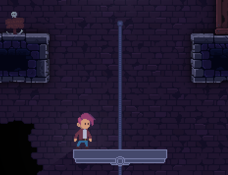

To create moving platforms, the first thing to do is to draw your platform rail tiles into any background tile layer so know which path the platform is supposed to follow. This is only an optical change to your level since the actual path your platform will follow is defined in an object group called `platforms`. Therefore the next step is to create this object group and to draw a polyline from start to end. The last thing to do is to create the actual platform. That's done by simply placing a rectangle into the same layer which overlaps the path you defined in the previous step. The width should be a multiple of `24px` and the height should be `12px`.


## One-Way Walls

When making the decision to build a platform game engine on top of a realistic physics system such as Box2D, the need to have one-way walls is - from the software developer perspective - the greatest imaginable pain in the ass. Anyway, they're implemented. You are welcome.

If you ever played any Mario title in your life, you will know what a one-way wall is. The concept is very simple: The player jumps up, the player passes through the wall. The player starts falling down again, the wall becomes solid.

Like the `level` tile layer, there's also a layer for tiles with one-way behavior. It is called `level_solid_onesided`. When designing the shape of these tiles in Tiled's 'Tile Collision Editor', they should be defined as boxes with a height of 1px and a width of 24px:

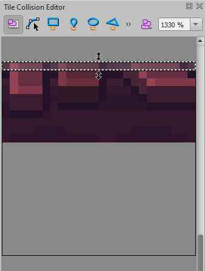

So once all the tile shapes are set up, they can be drawn into the tile layer. When that's done, it is possible to debug the generated physics shapes in the game by pressing `F1`.

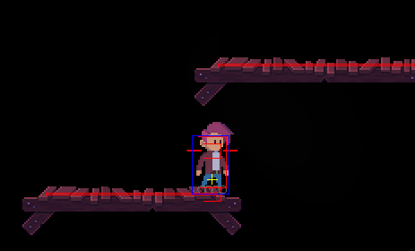

While the player moves through the one-way walls by pressing the jump key / button, it is possible to drop from a one-way wall by pressing jump together with the down key / button.


## Moveable Objects

At the moment this object type should rather be called 'Moveable Box' since their (rectangular) shape and texture is hardcoded. However, that might change in the future.

Anyhow, Moveable Objects are objects the player can push from one position to another just by walking against it. This way Adam might be able to climb obstacles, block enemies, etc.

The way to create a moveable object, create a rectangle object inside the object group `moveable_objects`. So far the sprite set supports 24x24px and 48x48px boxes. Depending on the size of your rectangle object, the right texture is selected.

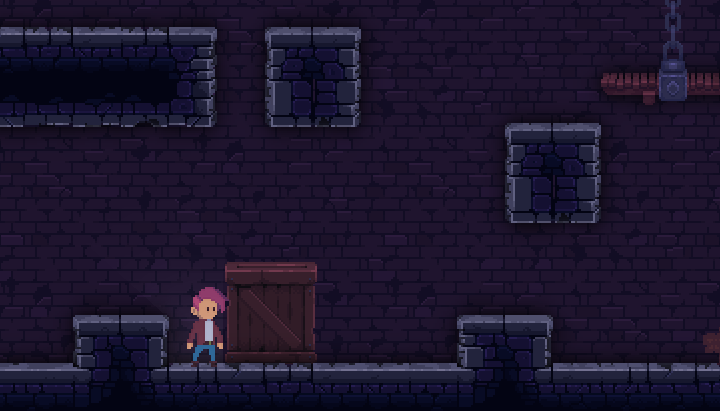


## Extras

Extras are currently hardcoded, i.e. the ID of each extra in the extra tileset is mapped to one particular extra inside the C++ code. Whenever Adam 'collides' with an extra tile, the Engine's `ExtraManager` is invoked. This is where you'd have to adjust the engine as needed.

```cpp
  case ExtraItem::ExtraSpriteIndex::Banana: // this is your tile id
    SaveState::getPlayerInfo().mExtraTable.mHealth.addHealth(10);
    break;
```

Apart from that, placing extras in your level is easy. Just create a tile layer called `extras` where you place your extra tiles.


## Dialogues

The Deceptus Engine can display message boxes which are shown when the player is inside a defined area and presses a button to activate the message box.
This is usually the `up` button of your keyboard or dpad.

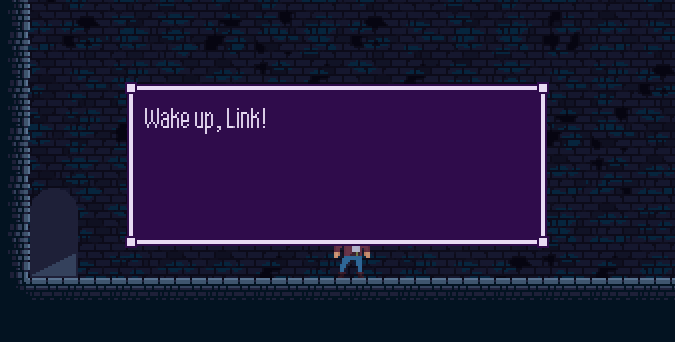

The message boxes can vary in color and can contain multiple messages.
In the future they might be extended so they can alter in location, color and animation.

In order to introduce a message box, you create an object layer 'dialogues' where you define a rectangle that defines the area where a message box is shown when activated.


Each message box has the custom properties below:

|Custom Property|Type|Description|
|-|-|-|
|01|string|The first message to show|
|02|string|The second message to show|
|03|string|The third message to show|
|nn|string|The nth message to show, you get the idea...|
|color|color|The color of the message box|
|open_automatically|bool|The dialogue open just on collision with the player, no button needs to be pressed.|

Moreover, you can use the tags below inside your dialogue strings:

|Keyword|Description|
|-|-|
|`<br>`|Add a line break|
|`<player>`|Insert the name of the player|


## Controller Help

When you're designing tutorial levels that should introduce the user to the basic game controls, it makes sense to visualize those controls inside the level.
E.g. when the player has to press a certain button to open a door etc. the related button could be indicated.

You do so by creating a layer called `controller_help` and inserting rectangles in there for those areas where help should be shown.

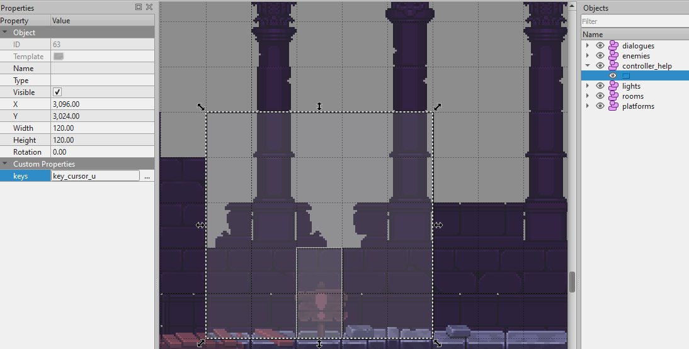


|Custom Property|Type|Description|
|-|-|-|
|keys|string|A semicolon delimited string that lists the key/button combinations to be shown|

### Available Keys

||0|1|2|3|4|5|6|7|8|9|10|11|12|13|14|15|
|-|-|-|-|-|-|-|-|-|-|-|-|-|-|-|-|-|
|0|`key_esc`|`key_1`|`key_2`|`key_3`|`key_4`|`key_5`|`key_6`|`key_7`|`key_8`|`key_9`|`key_minus`|`key_equals`|`key_backspace`||||`
|1|`key_tab`|`key_q`|`key_w`|`key_e`|`key_r`|`key_t`|`key_y`|`key_u`|`key_i`|`key_o`|`key_p`|`key_bracket_l`|`key_bracket_r`||||`
|2|`key_caps`|`key_a`|`key_s`|`key_d`|`key_f`|`key_g`|`key_h`|`key_j`|`key_k`|`key_l`|`key_semicolon`|`key_apostrophe`|`key_return`||||`
|3|`key_shift`|`key_0`|`key_z`|`key_x`|`key_c`|`key_v`|`key_b`|`key_n`|`key_m`|`key_comma`|`key_period`|`key_question`|`key_backslash`||||`
|4|`key_ctrl`|`key_win`|`key_alt`|`key_empty`|`key_list`|||||`key_cursor_l`|`key_cursor_u`|`key_cursor_d`|`key_cursor_r`||||`
|5|`bt_a`|`bt_b`|`bt_x`|`bt_y`|`bt_list`|`bt_menu`|`bt_rt`|`bt_lt`|`bt_lb`|`bt_rb`|||||||`
|6|`dpad_u`|`dpad_d`|`dpad_l`|`dpad_r`|`bt_u`|`bt_d`|`bt_l`|`bt_r`|`bt_1`|`bt_2`|`bt_3`|`bt_4`|`bt_5`|`bt_6`|`bt_7`|`bt_8`|`
|7|`bt_r_u`|`bt_r_d`|`bt_r_l`|`bt_r_r`|`bt_r_u_d`|`bt_r_l_r`|`dpad_empty`|`bt_0`|`bt_9`|`bt_10`|`bt_11`|`bt_12`|`bt_13`|`bt_14`|`bt_15`|`bt_16`|`
|8|`bt_l_u`|`bt_l_d`|`bt_l_l`|`bt_l_r`|`bt_l_u_d`|`bt_l_l_r`|||||||||||`

Depending on whether a keyboard or a game controller is connected, the buttons below will be mapped as follows:

|Key|Button|
|-|-|
|`key_cursor_u`|`dpad_u`|
|`key_cursor_d`|`dpad_d`|
|`key_cursor_l`|`dpad_l`|
|`key_cursor_r`|`dpad_r`|
|`key_return`|`bt_a`|
|`key_escape`|`bt_b`|
