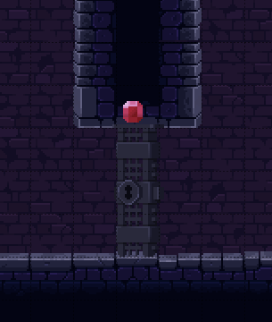
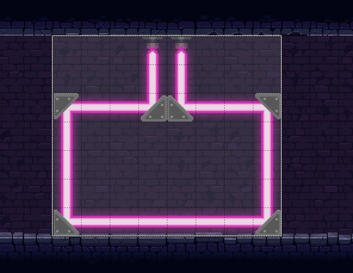
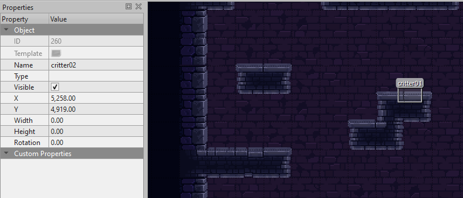
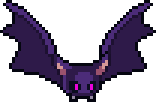
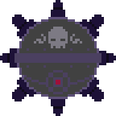
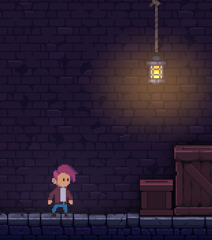
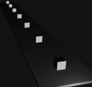
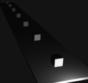
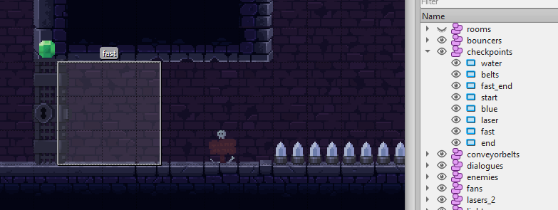

# Designing a Level

Levels in Deceptus use the Tiled Editor file format _tmx_.
In order to make your first level you will need two things:
Tiled and a solid sprite sheet, also called tileset.

<br>

## Some Terms
A _sprite sheet_ is a big texture (an image) that contains all the elements that you want to use in your level. Those are called _sprites_.<br>
You can use as many sprite sheets as you like, however Deceptus only supports one sprite sheet per _layer_.
A layer is something like a transparent sheet where you can draw things on. And you can put as many of these sheets on top of each other, all combined resulting into one final image.<br>
Likewise, your level can consist of many layers put on top of each other.
So you can have a layer for things that should always be in the foreground, another layer for all the stuff that's directly located around our game character and another layer for the background. While writing this, our hero does not have a name yet, so let's just call him Adam for now.

<br>

## Your Tileset

Each game defines a particular tile size (the width and height) of a tile in the sprite sheet. Deceptus went for `24x24px`. If you want to go for a different tile size, you'd have to change the code of the game (`constants.h`).<br>
Furthermore, we have decided that 2 tiles should represent 1m in the 'real world'. This is relevant for the physics behavior of the game. So it's good to keep in mind that 48 pixels are equivalent to 1 meter. This constant can also be altered in the game code if needed.

<br>

## Your Tiles

Deceptus differentiates between _colliding_ and _non-colliding_ tiles. The latter are tiles that are just drawn onto the screen. They don't have any other influence on the behavior of the game. Colliding tiles on the other hand are those tiles Adam is standing on or bouncing into such as the floor, the walls, etc.<br>
Tiled comes with a 'Tile Collision Editor' where you can define the shape of each tile. This is either a simple rectangle, but it can also be a more complex polygon. That's really up to your level design. In any case, defining the shape of the colliding tiles is probably the first chore that you have to do when starting the design of a level.


Keep in mind that the shapes used for each tile will be merged into one big 2D model ('mesh') later on. The merging step only works if the polygons are really accurate. The mesh optimizer used here will create 2 edges instead of 1 if a point of your polygon (vertex) is off by just 1px. To make sure that your vertices really align with each other, it is recommended to open up the tmx file in a text editor and compare if the values match:

```xml
  <tile id="74">
   <objectgroup draworder="index" id="2">
    <object id="1" x="0" y="0" width="24" height="24"/>
   </objectgroup>
  </tile>
  <tile id="75">
   <objectgroup draworder="index" id="2">
    <object id="1" x="0" y="0" width="24" height="24"/>
   </objectgroup>
  </tile>
```

## Level Layers

### A First Test Run

The first thing you want to do next is to define the colliding layer of your level because once you've done that, you are actually able to try it out inside the game engine.

This layer _must_ be called 'level' and it should have a custom property of type `int` with the value `15`. More on that later.

When you save the tmx file the game will evaluate all the collision information that you defined in the Collision Editor, merge that to one large mesh and pass that to the physics engine.

Now you've got to define a JSON file that describes the most basic information about your level, such as
- the filename of your level
- Adam's start position

To do so, create a subdirectory inside the game's `data` folder such as `level-awesome` and copy your tmx file and all related files such as your sprite sheets etc. to this folder. Now create a file called `level.json` that looks like the one below:

```json
{
  "filename": "data/level-awesome/my_awesome_level.tmx",
  "startposition": [45, 27]
}
```

The `filename` property just points to your tmx file.<br>
The `startposition` property is a x, y array that defines Adam's start position. This position is in tile coordinates. You can see the tile coordinates at Tiled's status bar at the bottom. This is why it's been decided that tile coordinates are more convenient than pixel coordinates.

The last step needed to be finally able to play your first level is to define the order of your levels. For that purpose, open up `data/config/levels.json` and create a section for your level. If you put it first, it will load right after you start a new game:

```json
[
   {
      "levelname": "data/level-awesome/level.json"
   },
   ...
]
```

Now you're all set! Go and try out your first level!

<br>

### Adding More Layers

Of course, having a single layer level will look a bit dull so you're probably interested in how to add layers to the foreground and background.

Deceptus currently supports 51 layers while the layer furthest away from your eye (in the background) has the z coordinate `0` and the frontmost layer has the z coordinate `50`. Adam moves around on `z = 16`. If you take a look at the previous paragraph, you'll notice that this is right on top of the level layer.

Deceptus could just use the layer order that you define inside your tmx file by moving layers up and down. However, the game engine wants to know the exact z coordinate of each layer since that's much more predictable than auto-computing the z coordinate from your layer stack inside Tiled. This is why each layer should have z custom property `z` of type `int`.

|Custom Property|Type|Description|
|-|-|-|
|z|int|The z depth of your layer from 0 (far far away) to 50 (frontmost)|

Wait, there's more! The Deceptus Engine supports a bunch of 'custom' layers such as _Parallax_ or _Image Layers_ You won't need any of that during your early design steps but once your gameplay is solid, feel free to move on to the chapter 'Visualization'.

<br>
<br>

# Mechanisms

The next thing you might want to do is to either add mechanisms to your level or add enemies. With respect to the workflow, both is fine. So you can either jump to the _Enemies_ paragraph or keep reading about mechanisms.

All mechanisms in the game are hard-coded. That means that the only way to change their basic design or behavior by altering the C++ code of the game. Mechanisms use different approaches for their setup. While some might be based on tile layers, others are based on object layers and some use a combination of both.

<br>

## Bouncers

Bouncers allow the player to jump very high or bounce him far into the direction the bouncer points to. At the moment only bouncers pointing up are supported.

In order to create a bouncer, create an object group '`bouncers`' and set the object group's `z` property. Then create one rectangle inside the 'bouncers' group for each bouncer.

Now change the object's default properties below:
|Property|Type|Description|
|-|-|-|
|Width|float|The width of the bouncer should be set to `24.0` for horizontally aligned bouncers.|
|Height|float|The height of the bouncer should be set to `5.0` for horizontally aligned bouncers.|

Bouncers use the `tilesets/bumper.png` texture inside your level directory.

<br>

## Conveyor Belts

When Adam jumps onto a conveyor belt, he moves along the conveyor belt either to the left or to the right.

Conveyor belts are created just like bouncers. First, create an object group '`conveyorbelts`' and set the object group's `z` property. Now create one rectangle inside the group for each belt.

The belts have a height of half a tile, their width should be a multiple of 24px.

Now change the object's default properties below:
|Property|Type|Description|
|-|-|-|
|Width|float|The width of the belt should be a multiple of `24.0`.|
|Height|float|The height of the belt should be set to `12.0`.|

Next add a custom property for the velocity:

|Custom Property|Type|Description|
|-|-|-|
|velocity|float|Negative values make the player move to the left, positive values move him to the right. Good values are probably something like `-0.6` and `0.6`.|

Conveyor belts use the `tilesets/cbelt.png` texture inside your level directory.

<br>

## Doors

Doors are not to be confused with 'Portals'. While the latter teleport you from one place to another, doors serve the purpose of a gate that allows you to move from one room to another.

The door implementation is based on tiles only.

All doors are defined in a layer labelled `doors`. Wherever there are 2 or more adjacent tiles inside this layer, they are merged together to a door. On top of the door there can be an indicator for a required key. There are different keys the player can pick up for different types of doors. At the moment they're all color-coded (red, green, blue, yellow, orange) but the implementation could be changed anytime.

If the door should not require a key to open it, then just don't add a key tile at its top.

Just like every other layer, doors also require a `z` custom property.




## Fans

Fans work just like fans from the real world, however they are _slightly_ stronger than in the real world. So, depending on where they are pointing to, they can make Adam fly or serve as an impassable obstacle.

This mechanism uses a mix of layers and objects. While the fans inside the tile layer called `fans` determine the direction of the air flow, rectangles in the object layer `fans` determine the active area of the fans. The idea is that all fans within one rectangle work together as one unit. So when defining the rectangles make sure they nicely overlap with the fan tiles. You can achieve that by using the `ALT`-key inside Tiled.

Apart from the `z` depth, fans have a 'speed' value:

|Custom Property|Type|Description|
|-|-|-|
|speed|float|The speed value typically ranges from [`0..1`], `0.9` turned out to be a suitable value.|


## Lasers

Lasers follow the same concept as fans and are based on a combination of tiles and objects. Since the tileset allows rather complex laser shapes including mirror tiles, the object layer is used so you can group your laser tiles to one coherent 'unit'.

So the first thing you do is to place all your laser tiles inside a tile layer called `lasers_2` and then create an object layer `lasers_2` where you draw a rectangle that covers all the laser tiles that belong together (`_2` because we want to use the 2nd version of the laser implementation).

Apart from the `z` depth, lasers have the custom properties below:

|Custom Property|Type|Description|
|-|-|-|
|off_time|int|The duration the laser is in 'off' state (in ms)|
|on_time|int|The duration the laser is in 'on' state (in ms)|



## Platforms

Tile layer: platforms
Rail layer: platform_rails
Object layer: platforms

## Portals

Tile layer: portals
Object layer: portals


## Crushers
## Deathblocks
## Levers
## Ropes
## Spikeballs
## Spikes


## Extras

Tile layer: extras


<br><br><br>

# Enemies

With the aim to give non-C++ programmers the ability to develop or adjust the behavior of enemies, all enemies were implemented in `lua`. Inside the folder `data/scripts/enemies` you will find a number of scripts you can use as a reference to implement your own enemies or alter their behavior as needed.

The Deceptus Engine offers two ways to integrate enemies inside your level.

## Adding Enemies

In the early days of the Deceptus Engine enemies were added just by defining a huge list of references to the enemy lua scripts bundled together with a couple of properties such as their start positions or the path they move along.

You can configure enemies by editing the json by hand, or - depending on your liking - directly position enemies inside Tiled.

### Adding Enemies with level.json

The first thing to do is to have a json array `enemies` inside your json file.
```json
  "enemies": [

  ]
```

Next, you have to have one section for each enemy instance inside this array. For this purpose you would usually define the '`script`' as well as '`startposition`' of your enemy. The start position is entered in tile coordinates.
```json
    {
      "script": "ghost.lua",
      "startposition": [233, 82],
      "path": [238, 82]
    },
    {
      "script": "bonefish.lua",
      "startposition": [250, 99],
      "path": [250, 99, 256, 99]
    },
```

All properties that are applicable for each enemy type are listed below.

<br>

### Adding Enemies with Tiled

The Tiled approach follows the same concept with the only difference that properties required to configure an enemy are entered through Tiled's Custom Properties. Of course the start position does no longer need to be entered manually since you will just position your enemy inside Tiled.

In order to insert an enemy in your level using the Tiled editor, create an object group called '`enemies`' and insert a rectangle at that location where your enemy should be positioned. Then define all enemy properties inside the Custom Properties, such as


|Custom Property|Type|Description|
|-|-|-|
|script|string|Name of the enemy's lua script|
|path|string|A comma separated list of positions in tile coordinates (x0, y0, x1, y1, etc.)


<br>

### Adding Enemies with Tiled and level.json

In order to make things a bit more confusing, there's even a third way to place enemies inside your level. And the choice is really up to you, there's no 'wrong' way to do it. In this method, you just place a rectangle object inside your `enemies` object group and remember its _Object ID_.



Then, you open up the `level.json` description and add a reference to that object. Now, just add further enemy-related properties to the json as described in the first paragraph of this chapter.

```json
    {
      "script": "critter.lua",
      "id": "260",
      "generate_path" : true
    },
```

Below you will find a description of all enemies including a table of their properties.

<br><br>

## Enemy Design and Properties

### Arrow Trap


Arrow Traps shoot arrows in a particular direction.

|Property|Type|Description|
|-|-|-|
|script|string|`arrowtrap.lua`|
|alignment|string|Arrow direction: '`up`', '`down`', '`left`', '`right`'|

<br>

### Bat



A bat usually sleeps somewhere at the ceiling of a room. When woken up by Adam, it attacks.

|Property|Type|Description|
|-|-|-|
|script|string|`bat_2.lua`|
|script|string|Name of the enemy's lua script|

<br>

### Blob


A Blob can either move left and right on the floor or ceiling of a room, jump up and down and actually even jump down and up.

|Property|Type|Description|
|-|-|-|
|script|string|`blob_2.lua`|
|jump_height_px|string|If the Blob should jump, define its jump height in `px`|
|gravity_scale|float|If the Blob should walk the ceiling instead of the floor, you can set its gravity scale to `-1.0`. It'll go positive once the Blob is right over Adam. Then it'll fall down.|
|jump_interval_ms|int|If the Blob should jump, you have to define its jump interval (in `ms`).|
|path|string|Usually you would only define a 2nd x,y-position here which will make the Blob go back and forth between its start position and the other position. You can also enter more than one position if needed. Format: `x0, y0, x1, y1, etc.`|

<br>

### Bonefish


|Property|Type|Description|
|-|-|-|
|script|string|`bonefish.lua`|
|path|string|Usually you would only define a 2nd x,y-position here which will make the Bonefish go back and forth between its start position and the other position. Format: `x0, y0, x1, y1, etc.`|

<br>

### Cannon


Well... it's a cannon. It fires... cannon balls.

|Property|Type|Description|
|-|-|-|
|script|string|`cannon_2.lua`|
|alignment|string|Cannons either point to the '`left`' or to the '`right`'.|


<br>

### Critter


Small spiky enemy that can crawl up walls and simply goes its way round and round and round without ever getting tired.

|Property|Type|Description|
|-|-|-|
|script|string|`critter.lua`|
|generate_path|bool|If `true`, the Deceptus Engine will automatically trace the edge the Critter has been placed on and turn it into a path. Then the Critter will follow this path. This only works for closed loops.|

<br>


### Ghost


Ghosts fly around following a given path. When Adam gets close by, they try to scare him away.

|Property|Type|Description|
|-|-|-|
|script|string|`critter.lua`|
|path|string|The ghosts path given as a list of x,y-positions; format: `x0, y0, x1, y1, etc.`|

<br>

### Klonk


A heavy solid piece of stone that gets angry when Adam is underneath and tries to squash him.

|Property|Type|Description|
|-|-|-|
|script|string|`klonk_2.lua`|


<br>

### Landmine


Ugly piece of technology. When Adam steps onto one of these, it's time to run real quick.

|Property|Type|Description|
|-|-|-|
|script|string|`landmine.lua`|

<br>


### Watermine



Another ugly piece of technology. Same concept as landmine but underwater.

|Property|Type|Description|
|-|-|-|
|script|string|`watermine.lua`|


<br><br><br>

# Visualization


## Adding Parallax Layers

In order to create the illusion of depth, some time in the 90s Parallax layers were introduced. Those are basically layers in the background that scroll at a different pace than the foreground.

Deceptus supports 3 Parallax layers.<br>
All Parallax layer names must start with `parallax_`.

They have the properties below:
|Custom Property|Type|Description|
|-|-|-|
|parallax|float|The scrolling pace in relation to the foreground [`0..1`]|
|parallax_view|int|The reference to the Parallax layer slot. Since Deceptus supports 3 slots, the value range goes from [`0..2`]|


<br><br>

## Adding Image Layers

If you want to insert images into your level without being restricted to the 24x24px tile size, you can use Image Layers. In order to do so, you can just create a new 'Image Layer' inside Tiled.

Deceptus supports different blend modes for Image Layers.

They have the properties below:
|Custom Property|Type|Description|
|-|-|-|
|blendmode|string|Valid blend modes are: '`alpha`', '`multiply`', '`add`', '`none`'|

<br><br>

## Static lights

Static lights are probably the simplest 'visual effect' inside the Deceptus Engine. They are basically additive sprites, i.e. the sprites' color information is added on top of the color of your level.



Static lights are added by introducing a new object group starting with `static_lights`.

The individual lights are created as rectangle objects with the parameters below:

|Custom Property|Type|Description|
|-|-|-|
|color|color|Color of the light (optional, the default is white)|
|flicker_intensity|float|If the light should flicker a bit, this controls the flicker intensity (optional, from `0..1`, a good value is `0.5`)|
|flicker_alpha_amount|float|The opacity of your light source (optional, from `0..1`, a good value is `0.7`)|
|flicker_speed|float|How fast to step through the flicker noise function (optional, from `0..100`, a good value is `5`|

<br><br>

## Dynamic Lights

In order to make the games atmosphere more lively, the Deceptus Engine comes with a shader (a program run on your GPU) that implements light sources that cast shadows and illuminate your objects. The latter uses bump maps. Those are texture that describe how your objects reflect light. Shadows are cast based on the collision information that you define in your `level` layer.

In order to create a dynamic light source, have an object layer called `lights` inside your level. Into that layer you add rectangle objects. The width and height of that rectangle define the maximum range of your light. However, your actual light behavior is controlled by the custom properties below. They are based on the concept of 'Constant-Linear-Quadratic Falloff'. Yup, you can google that.

|Custom Property|Type|Description|
|-|-|-|
|color|color|The color of your light source (default is white)|
|falloff_constant|float|The amount of illumination that is independent of the distance to the light source (range `0..1`). The name is a bit misleading. There's no falloff at all. The function is simply `attenuation = 1 / falloff_constant`. A good value is `0.4`. <br><br>|
|falloff_linear|float|The further away from the light, the darker it gets. `falloff_linear` is a factor for the distance (`attenuation = 1 / (falloff_linear * distance_to_light)`). A good value is `3`.<br><br>|
|falloff_quadratic|float|The further away from the light, the less illumination - but this time the distance is squared (`attenuation = 1 / (falloff_linear * distance_to_light^2)`). A good value is `20`.<br><br>|

```
[
    {
        "name": "center_offset_x_px",
        "type": "int",
        "value": 0
    }
]
[
    {
        "name": "center_offset_y_px",
        "type": "int",
        "value": -72
    }
]
[
    {
        "name": "texture",
        "type": "string",
        "value": "topdown_large.png"
    }
]
```

<br><br>

## Atmosphere layers

<br><br>

## Ambient Occlusion


<br><br><br>


# Advanced Topics

## Checkpoints

Whenever Adam reaches a checkpoint, the current state of the game is saved. I.e. the player's current skills (such as double jump, wall slide, wall jump etc.) and the player's location within the level are serialized to disk. When the player dies later on, he would re-spawn at the last checkpoint.

Checkpoints are implemented as simple rectangle objects inside your level. In order to add checkpoints to your level, define an object group '`checkpoints`' and add rectangles inside this group that have reasonable names. The last checkpoint, i.e. the end of your level, must have the name '`end`'.




<br>

## Rooms

Usually the game's camera system keeps on following Adam so he always stays in focus. However, in Metroid-like games it's quite common to limit the camera range to one room, open a door, go to the next room and then move the camera's focus over to the other room.

If you are using rooms, it is important to make them at least as large as your screen (640x360px). Having rooms smaller than one screen would defeat the point of having rooms, hey?

If you define 2 rooms, the camera would limit the viewer's perspective to that room until the player has left that room. Then the camera would either move over to the next room or just focussing Adam if he entered a region where no room is defined.

Rooms are rectangles, or combinations of rectangles. In order to define a room, create an object group '`rooms`' first, then draw rectangles around those area that are supposed to be your rooms. Rooms should be given descriptive labels such as '`kitchen`' or '`bathroom`'. If you want to merge multiple rects together to one larger room, you can also do that. Just append '`_0`', '`_1`' etc. to your room labels such as '`bedroom_0`', '`bedroom_1`' even though no sane person would ever voluntarily merge their bedrooms.


